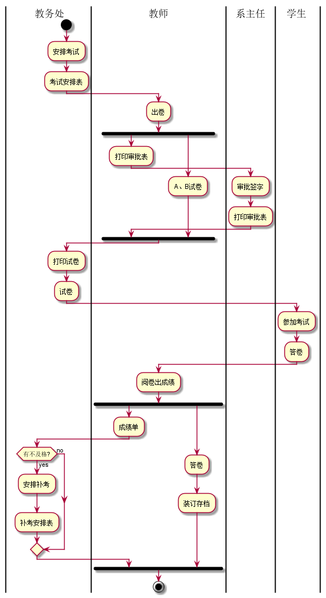

# 实验1：业务流程建模
|学号|班级|姓名|照片|
|:-------:|:-------------: | :----------:|:---:|
|201610414325|软件(本)16-3|25.吴伟辉||

## 流程图1：考试及成绩管理流程

**PlantUML源码如下：**

``` flow1
@startuml
|教务处|
start
:安排考试;
:考试安排表;
|教师|
:出卷;
fork
:打印审批表;
|系主任|
:审批签字;
:打印审批表;
|教师|
fork again
:A、B试卷;
end fork
|教务处|
:打印试卷;
:试卷;
|学生|
:参加考试;
:答卷;
|教师|
:阅卷出成绩;
fork
:成绩单;
|教务处|
if (有不及格?) then (yes)
:安排补考;
:补考安排表;
else(no)
endif
|教师|
fork again
:答卷;
:装订存档;
end fork
stop
|学生|

@enduml
```

**业务流程图如下：**



**流程说明：**

教务处负责安排全校课程的考法时间和地点，下发“考试安排表”。考试前一周,各任课教师准备好
A、B两份试卷,填写“试卷打印审批表”并交与系主任审批签字,将选中的期末试卷和已签字的“试卷
打印审批表”送交教务处印刷部门进行印刷。学生按时到达指定考场参加考试，考试完毕任课教师
进行阅卷,产出成绩单,并对学生答卷装订存档。如果课程有不及格情况，教务处负责安排补老时间
和地点，产生“补考安排表”,流程结束

## 流程图2： 客户维修服务流程

**PlantUML源码如下：**

``` flow2
@startuml
|客户|
start
:申请服务;
|业务经理|
if (是新客户吗?) then (yes)
:登记客户信息;
else(no)
endif
:上门勘察;
:制订方案;
|客户|
if (满意吗?) then (yes)
:签订服务合同;
else(no)
stop
endif
|业务经理|
fork
:安排工人;
fork again
:安排材料;
end fork
:填写派工单;
|工人|
:领取材料;
:上门服务;
|客户|
:验收并填写反馈意见;
|业务经理|
:交回派工单;
|财务人员|
:结算收款;
stop
@enduml
```

**业务流程图如下：**


**流程说明：**

流程从客户申请服务开始，如果是新客户，业务经理将该客户的基本信下面再以UML活动图为例说
明某空调服务公司的客户维  多服务的业务信息记录六案进行沟通，下来。接如果达成一致,则签
订正式“ 服务合同”,否则流程终结。 根据合同方案，下来业务经理将上门进行勘察,并制定具体
“维修方案”。业务经理和客户业务经理将对实施材料上门
维修的人员和所需材料进行计划,并填发“派工单”。工人拿到派工单后,，领取指定材
业务经实施服务。服务完成后客户进行验收,并在“派工单”上填写维修信息和反馈意见。
理收回派I单后,通知财务人员进行项目的结算并收款.流程终结