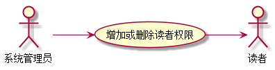
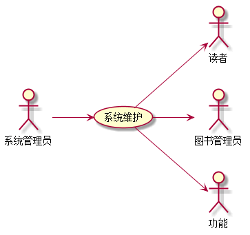

# 实验2：图书管理系统用例建模
|学号|班级|姓名|照片|
|:-------:|:-------------: | :----------:|:---:|
|201610414325|软件(本)16-3|吴伟辉||

## 1. 图书管理系统的用例关系图

### 1.1 用例图PlantUML源码如下：

``` usecase
@startuml
left to right direction
skinparam packageStyle rectangle
actor 图书管理员
actor 读者
actor 系统管理员
rectangle  {

  图书管理员-->(借出图书)
  图书管理员-->(归还图书)
  图书管理员-->(维护图书)
  图书管理员-->(维护读者信息)
  图书管理员-->(增加或者删除图书)
  (查询书目) <-- 读者
  (查询借阅情况) <-- 读者
  (预定图书) <-- 读者
  (取消预订) <-- 读者
  (维护读者信息)<--读者
  系统管理员-->(增加或删除读者权限)
  系统管理员-->(系统维护)
  系统管理员-->(维护图书管理员信息)

}
@enduml
```


### 1.2. 用例图如下：


## 2. 参与者说明：

###     2.1 图书管理员

主要职责是：借出图书，归还图书，维护图书，维护读者信息，增加或删除图书

###     2.2 读者

主要职责是：维护读者信息，查询书目，查询借阅情况，预定图书，取消预定

###     2.3 系统管理员
    
主要职责是：增加或者删除读者权限，系统维护，图书管路员信息维护

##     3. 用例规约表

###     3.1 “借出图书”用例


|  用例名称  | 参与者 |  前置条件 | 后置条件 | 主事件流 |  备注  |
|:-------:|:-------:|:-------:|:-------:|:-------:|:-------:|
|借出图书|图书管理员（主要参与者）、读者（次要参与者）|图书管理员已被识别和授权|存储借书记录，更新库存数量，所借图书状态为借出| 1.图书管理员将读者借书卡提供给系统<br>2.系统验证读者身份和借书条件<br>3.图书管理员将读者所借图书输入系统<br>4.系统记录借书信息，并且修改图书的状态和此种书的可借数量<br>5.系统累加读者的借书数量<br>6.重复3~5，直到图书管理员确认全部图书登记完毕<br>7.系统打印借书清单，交易成功完成|图书馆开架借阅，读者找到书后办理借书手续，因此借书不需要验证库存，而且每本书都是可识别的|

**“借出图书”用例流程图源码如下：**
```usecase1_flow
@startuml

actor 图书管理员
actor 读者

图书管理员-->(借出图书)
(借出图书)<--读者

@enduml
```
**“借出图书”用例流程图如下：**<br>
 
 
###     3.2 “归还图书”用例

|  用例名称  | 参与者 |  前置条件 | 后置条件 | 主事件流 |  备注  |
|:-------:|:-------:|:-------:|:-------:|:-------:|:-------:|
|归还图书|读者（主要参与者），图书管理员（次要参与者）|图书已被读者借阅|存储还书记录，更新库存数量，所借图书状态为归还| 1.图书管理员将读者借书卡提供给系统<br>2.系统验证读者身份和所还书的信息<br>3.图书管理员将读者所归还图书输入系统<br>4.系统记录还书信息，并且修改图书的状态和此种书的可借数量<br>5.系统取消读者未归还状态<br>6.重复3~5，直到图书管理员确认全部图书登记完毕<br>7.交易成功完成|图书已经被借阅，读者找到书后办理归还手续，因此还不需要验证库存，而且每本书都是可识别的|


**“购入图书”用例流程图源码如下：**
``` uc2_flow
@startuml
start
:Hello world;
:This is on defined on
several **lines**;
stop
@enduml
```

**“购入图书”用例流程图源码如下：**<br>


###     3.3 “维护图书”用例
           
|  用例名称  | 参与者 |  前置条件 | 后置条件 | 主事件流 |  备注  |
|:-------:|:-------:|:-------:|:-------:|:-------:|:-------:|
|维护图书|图书管理员（次要参与者）|该图书存在|更新库存数量，更改图书状态| 1.图书管理员将将自己身份提供给系统<br>2.系统验证图书管理员身份<br>3.图书管理员将更新图书的存量和状态<br>4.系统记录存量，并且修改图书的状态和此种书的可借数量<br>7.操作成功，显示更新后的图书信息|
           
           
**“购入图书”用例流程图源码如下：**
 ``` uc3_flow
@startuml
left to right direction
actor 图书管理员
图书管理员-->(图书信息)
@enduml
 ```
 
**“购入图书”用例流程图源码如下：**<br>
           


           
###     3.4“维护读者信息”用例

|  用例名称  | 参与者 |  前置条件 | 后置条件 | 主事件流 |  备注  |
|:-------:|:-------:|:-------:|:-------:|:-------:|:-------:|
|维护读者信息|读者（主要参与者），图书管理员（主要参与者）|读者已经被系统管理员许可|更新读者的基本信息| 1.读者向系统管理员申请读者身份2.系统管理员同意申请<br>3.读者或者图书管理员可以对读者本身的信息进行编辑<br>4.读者信息更新<br>5.操作完成，读者信息更新成功|读者的申请需要经过系统管理员的同意|


**“购入图书”用例流程图源码如下：**
``` uc4_flow
@startuml
left to right direction
actor 图书管理员
actor 读者

图书管理员-->(维护读者信息)
(维护读者信息)<--读者

@enduml

```

**“购入图书”用例流程图源码如下：**<br>


###     3.5 “增加或者删除图书”用例

|  用例名称  | 参与者 |  前置条件 | 后置条件 | 主事件流 |  备注  |
|:-------:|:-------:|:-------:|:-------:|:-------:|:-------:|
|增加或者删除图书|图书管理员（主要参与者）|图书存在，或者不存在|存储图书记录删除图书，或者增加图书| 1.图书管理员将身份提供给系统<br>2.系统验证管理员信息<br>3.图书管理员将增加或者删除的图书的ID号输入系统<br>4.系统检测是否存在相同ID号的图书<br>5.如果检测到存在相同ID号的图书则重新进行第三步，没有检测到相同ID号的图书则进行下一步<br>6.图书增加或则删除成功，更新所有图书信息<br>7.操作完成，图书馆图书信息更新成功|增加或则删除图书需要输入图书的ID号用来唯一区别不同的图书|


**“购入图书”用例流程图源码如下：**
``` uc5_flow
@startuml
left to right direction
actor 图书管理员
图书管理员-->(增加或者删除图书)
@enduml
```

**“购入图书”用例流程图源码如下：**<br>


###     3.6 “查询书目”用例

|  用例名称  | 参与者 |  前置条件 | 后置条件 | 主事件流 |  备注  |
|:-------:|:-------:|:-------:|:-------:|:-------:|:-------:|
|查询书目|读者（主要参与者）|图书系统运行正常|查询所以有的图书，并且由系统显示出来 |1.读者将身份提供给给系统<br>2.系统验证读者身份<br>3.一开始系统显示所有的图书列表，读者可以在列表里面通过书名，作者，等查询图书<br>4.图书查询完毕|查询时，可按照书号（ID），书名，作者，入库时间等来查询图书|


**“购入图书”用例流程图源码如下：**
``` uc6_flow
@startuml
left to right direction
actor 读者
读者-->(查询图书)
@enduml
```

**“购入图书”用例流程图源码如下：**<br>


###     3.7 “查询借阅情况”用例

|  用例名称  | 参与者 |  前置条件 | 后置条件 | 主事件流 |  备注  |
|:-------:|:-------:|:-------:|:-------:|:-------:|:-------:|
|查询借阅情况|读者（次要参与者）|图书存在|查询到图书后，把图书最近的借阅情况显示出来| 1.读者将身份提供给给系统<br>2.系统验证读者身份<br>3.读者先查询目标图书<br>4.查询到目标图书后，点击显示查看最近借阅情况，显示出最近的借阅情况<br>5.操作成功完成|先显示最近10条借阅情况，点击查看详情后，显示更多的借阅情况|


**“购入图书”用例流程图源码如下：**
``` uc7_flow
@startuml
left to right direction
actor 读者
读者-->(查询借阅情况)
@enduml
```

**“购入图书”用例流程图源码如下：**<br>


###     3.8 “预定图书”用例

|  用例名称  | 参与者 |  前置条件 | 后置条件 | 主事件流 |  备注  |
|:-------:|:-------:|:-------:|:-------:|:-------:|:-------:|
|预定图书|读者（主要参与者），图书管理员（次要参与者）|图书的库存量大于1|存储预定记录，更新库存数量，所预定图书状态为预定| 1.图书管理员将读者借书卡提供给系统<br>2.系统验证读者身份和所预定书的信息<br>3.图书管理员将读者所预定图书输入系统<br>4.系统记录预定信息，并且修改图书的状态和此种书的可借数量<br>6.操作成功完成|图书已经被预定，读者找到书后办理借书手续，因此还不需要验证库存，而且每本书都是可识别的|


**“购入图书”用例流程图源码如下：**
``` uc2_flow
@startuml
       left to right direction
       actor 图书管理员
       actor 读者
       图书管理员-->(取消预定图书)
       (取消预定图书)-->读者
 @enduml
```

**“购入图书”用例流程图源码如下：**<br>


###     3.9 “取消预订”用例

|  用例名称  | 参与者 |  前置条件 | 后置条件 | 主事件流 |  备注  |
|:-------:|:-------:|:-------:|:-------:|:-------:|:-------:|
|取消预订|读者（主要参与者），图书管理员（次要参与者）|图书已被读者预定|存储取消预订记录，更新库存数量，所借图书状态为归还| 1.图书管理员将读者借书卡提供给系统<br>2.系统验证读者身份和所取消预定书的信息<br>3.图书管理员将读者所取消预定图书输入系统<br>4.系统记录取消预定信息，并且修改图书的状态和此种书的可借数量<br>5.系统取消读者预定状态<br>6.重复3~5，直到图书管理员确认全部图书登记完毕<br>7.交易成功完成|图书已经被预定，读者找到书后办理归还手续，因此还不需要验证库存，而且每本书都是可识别的|


**“购入图书”用例流程图源码如下：**
``` uc9_flow
@startuml
       left to right direction
       actor 图书管理员
       actor 读者
       图书管理员-->(取消预定图书)
       (取消预定图书)-->读者
 @enduml
```

**“购入图书”用例流程图源码如下：**<br>


###     3.10 “增加或删除读者权限”用例

|  用例名称  | 参与者 |  前置条件 | 后置条件 | 主事件流 |  备注  |
|:-------:|:-------:|:-------:|:-------:|:-------:|:-------:|
|增加或删除读者权限|系统管理员（主要参与者），读者（次要参与者）|删除已有的读者，增加新的读者|删除已有读者以后，读者的ID号也被删除；增加新的读者后，读者会被系统分配一个ID号| 1.登陆系统管理员帐号<br>2.如果是删除读者，先查询读者然后点击删除；如果是增加读者则点击增加读者按钮输入读者信息，系统给读者分配一个ID号，并且先出来<br>3.如果还要继续增加则重复第二步操作<br>4.操作完成！增加或删除读者成功|删除读者的时候可以批量删除，但是删除读者之前需要找到你想删除的读者|


**“购入图书”用例流程图源码如下：**
``` uc10_flow
@startuml
  left to right direction
  actor 系统管理员
  actor 读者
  系统管理员-->(增加或删除读者权限)
  (增加或删除读者权限)-->读者
 @enduml
```

**“购入图书”用例流程图源码如下：**<br>



###     3.11 “系统维护”用例

|  用例名称  | 参与者 |  前置条件 | 后置条件 | 主事件流 |  备注  |
|:-------:|:-------:|:-------:|:-------:|:-------:|:-------:|
|系统维护|系统管理员|系统暂时停止使用|更新系统功能，图书信息，读者信息，图书管理员信息|1.停止当前正在运行的图书管理系统<br>2.更新系统功能，<br>重新加载图书管理系统的所有资源<br>4.测试当前图书管理系统是否稳定<br>5.将新的图书管理系统发布到服务器上<br>6.操作成功完成，图书管理系统更新成功|维护是停机运行，也就是需要把当前的系统停止后，才能维护，开发新的功能并且上线|


**“购入图书”用例流程图源码如下：**
``` uc11_flow
@startuml
  left to right direction
  actor 系统管理员
  actor 读者
  actor 图书管理员
  actor 功能
  系统管理员-->(系统维护)
  (系统维护)-->读者
   (系统维护)-->图书管理员
    (系统维护)-->功能
 @enduml
```

**“购入图书”用例流程图源码如下：**<br>



###     3.12“维护图书管理员信息”用例

|  用例名称  | 参与者 |  前置条件 | 后置条件 | 主事件流 |  备注  |
|:-------:|:-------:|:-------:|:-------:|:-------:|:-------:|
|维护图书管理员信息|系统管理员（主要参与者），图书管理员（次要参与者）|登陆系统管理员，并且身份被系统成功验证|更新图书管理员的基本信息| 1.系统管理员查询到需要维护的图书管理员<br>2.编辑图书管理员信息，删除，修改等操作<br>3.是否继续操作？如果需要继续则重复1-2步<br>4.图书管理员信息更新<br>5.操作完成，图书管路员信息更新成功|系统管理员需要登录成功查询到相应的图书管理员才能对图书管理员的信息进行修改|


**“购入图书”用例流程图源码如下：**
``` uc4_flow
@startuml
  left to right direction
  actor 系统管理员
  actor 图书管理员
  系统管理员-->(维护图书管理员信息)
  (维护图书管理员信息)-->图书管理员
 @enduml
```

**“购入图书”用例流程图源码如下：**<br>


