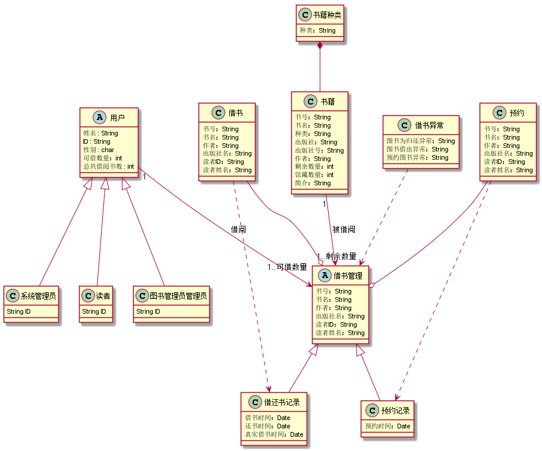
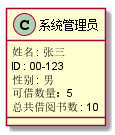
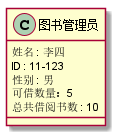
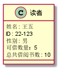
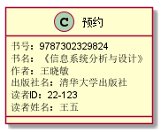
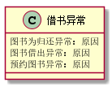
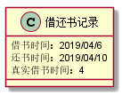
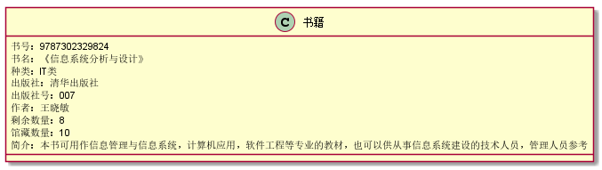

# 实验3：图书管理系统领域对象建模
|学号|班级|姓名|照片|
|:-------:|:-------------: | :----------:|:---:|
|201610414325|软件(本)16-3|吴伟辉||

## 1. 图书管理系统的类图

### 1.1 类图PlantUML源码如下：

``` class
@startuml
@startuml

abstract class 用户{

姓名 : String
ID : String
性别 : char
可借数量：int
总共借阅书数 : int

}


class 读者 extends 用户{
String ID
}
class 图书管理员管理员 extends 用户{
String ID
}
class 系统管理员 extends 用户{
String ID
}

abstract class 借书管理 {
书号：String
书名：String
作者：String
出版社名：String
读者ID：String
读者姓名：String

}
 class 借书异常{
图书为归还异常：String
图书借出异常：String
预约图书异常：String
}


借书异常..>借书管理

class 借还书记录 extends 借书管理{

借书时间：Date
还书时间：Date
真实借书时间：Date
}

class 借书{
书号：String
书名：String
作者：String
出版社名：String
读者ID：String
读者姓名：String

}
借书..>借还书记录

class 预约{
书号：String
书名：String
作者：String
出版社名：String
读者ID：String
读者姓名：String

}
预约..>预约记录
class 预约记录 extends 借书管理{

预约时间：Date
}
class 书籍{
书号：String
书名：String
种类：String
出版社：String
出版社号：String
作者：String
剩余数量：int
馆藏数量：int
简介：String
}
class 书籍种类{
种类：String
}
书籍种类*--书籍

书籍 "1" --> "1..剩余数量" 借书管理 : 被借阅

用户 "1" --> "1..可借数量" 借书管理 : 借阅

借书 --o 借书管理
预约 --o 借书管理

@enduml
@enduml
```

### 1.2. 类图如下：



### 1.3. 类图说明：
#### 1.3.1 用户（父类）：是一个抽象类，与借书管理相关联有以下属性：
    姓名 : String
    ID : String
    性别 : char
    可借数量：int
    总共借阅书数 : int
#### 1.3.2 系统管理员，读者，图书管理员 （子类）：继承于用户类通过ID不同来判断身份
    ID : String
#### 1.3.3 借书管理（父类）：是一个抽象类,又借书，和预约聚合所得，有以下属性:
     书号：String
     书名：String
     作者：String
     出版社名：String
     读者ID：String
     读者姓名：String
#### 1.3.4 借还书记录(子类)：继承了借书管理有以下属性:  
    借书时间：Date
    还书时间：Date
    真实借书时间：Date
#### 1.3.5 预约记录(子类)：继承了借书管理有以下属性:  
    预约时间：Data
#### 1.3.6 借书：依赖于借还书记录有以下属性:  
     书号：String
     书名：String
     作者：String
     出版社名：String
     读者ID：String
     读者姓名：String
#### 1.3.6 预约：依赖于借还书记录有以下属性:  
     书号：String
     书名：String
     作者：String
     出版社名：String
     读者ID：String
     读者姓名：String
#### 1.3.7 借书异常：依赖于借书管理有以下属性：
    图书为归还异常：String
    图书借出异常：String
    预约图书异常：String
#### 1.3.8 书籍：与借书管理相关联有以下属性: 
    书号：String
    书名：String
    种类：String
    出版社：String
    出版社号：String
    作者：String
    剩余数量：int
    馆藏数量：int
    简介：String
#### 1.3.9 书籍种类：与书籍是组合关系有以下属性: 
    种类：String
    
    
## 2. 图书管理系统的对象图
### 2.1 系统管理员类的对象图
#### 源码如下：
``` class
@startuml
class 系统管理员{
姓名 : 张三
ID : 00-123
性别 : 男
可借数量：5
总共借阅书数 : 10
}
@enduml
``` 
#### 对象图如下：


### 2.2 图书管理员类的对象图
#### 源码如下：
``` class
@startuml
class 图书管理员{
姓名 : 李四
ID : 11-123
性别 : 男
可借数量：5
总共借阅书数 : 10
}
@enduml
``` 
#### 对象图如下：


### 2.3 读者类的对象图
#### 源码如下：
``` class
@startuml
class 读者{
姓名 : 王五
ID : 22-123
性别 : 男
可借数量：5
总共借阅书数 : 10
}
@enduml
``` 
#### 对象图如下：


### 2.4 借书类的对象图
#### 源码如下：
``` class
@startuml
class 借书{
书号：9787302329824
书名：《信息系统分析与设计》
作者：王晓敏
出版社名：清华大学出版社
读者ID：22-123
读者姓名：王五
}
@enduml
``` 
#### 对象图如下：


### 2.5 预约类的对象图
#### 源码如下：
``` class
@startuml
class 预约{
书号：9787302329824
书名：《信息系统分析与设计》
作者：王晓敏
出版社名：清华大学出版社
读者ID：22-123
读者姓名：王五
}
@enduml
``` 
#### 对象图如下：


### 2.6 借书异常类的对象图
#### 源码如下：
``` class
@startuml
class 借书异常{
图书为归还异常：String
图书借出异常：String
预约图书异常：String
}
@enduml
``` 
#### 对象图如下：



### 2.7 借还书记录类的对象图
#### 源码如下：
``` class
@startuml
class 借还书记录 {
借书时间：2019/04/6
还书时间：2019/04/10
真实借书时间：4
}
@enduml
``` 
#### 对象图如下：


### 2.8 预约记录类的对象图
#### 源码如下：
``` class
@startuml
class 预约记录 {
预约时间：2019/4/8
}
@enduml
``` 
#### 对象图如下：


### 2.9 书籍类的对象图
#### 源码如下：
``` class
@startuml

class 书籍{
书号：9787302329824
书名：《信息系统分析与设计》
种类：IT类
出版社：清华出版社
出版社号：007
作者：王晓敏
剩余数量：8
馆藏数量：10
简介：本书可用作信息管理与信息系统，计算机应用，软件工程等专业的教材，也可以供从事信息系统建设的技术人员，管理人员参考
}
@enduml
``` 
#### 对象图如下：


### 2.10 书籍种类类的对象图
#### 源码如下：
``` class
@startuml
class 书籍种类{
种类：IT类
}
@enduml
``` 
#### 对象图如下：


