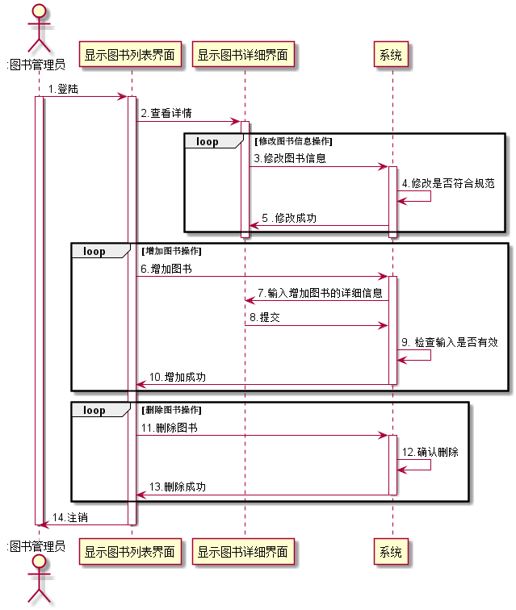

# 实验4：图书管理系统顺序图绘制
|学号|班级|姓名|照片|
|:-------:|:-------------: | :----------:|:---:|
|12345678|软件(本)15-4|赵卫东||

## 图书管理系统的顺序图

## 1. 借书用例
## 1.1. 借书用例PlantUML源码

``` sequence4_1
@startuml
actor ":读者"
actor ":图书管理员"
":读者"->"图书列表" :1. 查询图书
activate "图书列表"
activate ":读者"
"图书列表"->"图书" :2. 选择图书
activate "图书"
"图书"->":读者" : 3.选择图书成功
deactivate "图书"
deactivate "图书列表"
deactivate ":读者"
loop

":读者"->":图书管理员" :4.提交借阅书籍
activate ":读者"
activate ":图书管理员"
":图书管理员" ->"借书界面" :5.处理图书
activate "借书界面"

"借书界面"->":借书信息" :6.获取图书信息
activate ":借书信息"
":借书信息"->"借书界面" :7.图书信息
deactivate ":借书信息"
deactivate "借书界面"

":系统"<-"借书界面" :8.增加借阅记录
activate "借书界面"
activate ":系统"

":系统" -> ":系统" : 9.检查图书剩余量
":系统" -> ":系统" : 10.检查读者可借图书本数
":系统"-> "借书界面" : 11.增加借阅记录成功
"借书界面" ->":图书管理员" :12.借阅成功
":图书管理员"->":读者" :13.允许读者带走书籍
deactivate ":系统"
deactivate "借书界面"
deactivate ":读者"
deactivate ":图书管理员"
end
@enduml
```

## 1.2. 借书用例顺序图


## 1.3. 借书用例顺序图说明
    读者先查询到所需借阅的图书，然后将书籍提交给图书管理员，图书管理员获取到书籍以
    后对书籍进行处理得到图书的信息，然后在再系统查看图书的剩余量和该读者还能借多少
    本数，最后允许读者借阅此书

***

## 2. 还书用例
## 2.1. 还书用例PlantUML源码

``` sequence
@startuml
actor ":读者"
actor ":图书管理员"
loop
":读者"->":图书管理员" :1.提交归还书籍
activate ":读者"
activate ":图书管理员"
":图书管理员" ->"还书界面" :2.处理图书
activate "还书界面"

"还书界面"->":还书信息" :3.获取图书信息
activate ":还书信息"
":还书信息"->"还书界面" :4.图书信息
deactivate ":还书信息"
deactivate "还书界面"

":系统"<-"还书界面" :5.删除借阅记录
activate "还书界面"
activate ":系统"

":系统" -> ":系统" : 6.检查是否过期
":系统" -> ":系统" : 7.删除借阅记录
":系统"-> "还书界面" : 8.删除记录成功
deactivate ":系统"
"还书界面"->":图书管理员" :9.处理图成功
deactivate "还书界面"
":图书管理员"->":读者" :10.还书成功
deactivate ":图书管理员"
deactivate ":读者"
end
@enduml
```

## 2.2. 还书用例顺序图


## 2.3. 还书用例顺序图说明
    因为是还书，所有不需要读者的认证。首先读者需要将需要归还的书交给图书管理员，图
    书管理员对图书进行处理获取到图书的信息。然后图书管理员在系统中检车读者的借书时
    间是否超过规定的期限。最后删除读者的借阅记录，还书成功。
***

## 3. 维护图书用例
## 3.1. 维护图书用例PlantUML源码

``` sequence
@startuml
@startuml
actor ":图书管理员"

":图书管理员"->"显示图书列表界面" : 1.登陆
activate ":图书管理员"
activate "显示图书列表界面"
"显示图书列表界面"->"显示图书详细界面" : 2.查看详情
activate "显示图书详细界面"
loop 修改图书信息操作
"显示图书详细界面"->"系统" : 3.修改图书信息
activate "系统"
"系统"->"系统" :4.修改是否符合规范
系统->"显示图书详细界面" : 5 .修改成功
end
deactivate "系统"
deactivate "显示图书详细界面"
loop 增加图书操作
"显示图书列表界面"->"系统" :6.增加图书
activate "系统"
"系统"->"显示图书详细界面" :7.输入增加图书的详细信息
"系统"<-"显示图书详细界面" :8.提交
"系统"->"系统" :9. 检查输入是否有效
"系统"->"显示图书列表界面" :10.增加成功
deactivate "系统"
end
loop 删除图书操作
"显示图书列表界面" ->"系统" : 11.删除图书
activate "系统"
"系统"->"系统" :12.确认删除
"系统"->"显示图书列表界面" : 13.删除成功
deactivate "系统"
end
"显示图书列表界面"->":图书管理员" :14.注销
deactivate "显示图书列表界面"
deactivate ":图书管理员"
@enduml
@enduml
```

## 3.2. 维护图书用例顺序图


## 3.3.维护图书用例顺序图说明
    图书管理员先登录，查看所有图书信息。
    修改图书信息：点击显示图书详细，在此界面有一个修改图书的按钮，点击则可以修改图
    书信息，然后将修改的内容提交给系统，系统经过验证以后提示修改成功，
    增加图书：图书管理员在显示所有图书页面有一个按钮，点击则可以跳转到输入图书详细
    信息页面，输入完成以后提交给系统，系统经过验证以后返回提示系统管理员增加图书成
    功。
    删除图书：图书管理员在显示图书列表每一个图书后面都有一个删除按钮，点击后系统提
    示是否删除此图书，确认后系统将删除此图书

***

## 4. 预定图书用例
## 4.1. 预定图书用例PlantUML源码

``` sequence
@startuml

actor ":读者"
actor ":图书管理员"
":读者"->"图书列表" :1. 查询图书
activate "图书列表"
activate ":读者"
"图书列表"->"图书" :2. 选择图书
activate "图书"
"图书"->":读者" : 3.选择图书成功
deactivate "图书"
deactivate "图书列表"
deactivate ":读者"
loop

":读者"->":图书管理员" :4.提交预定书籍
activate ":读者"
activate ":图书管理员"
":图书管理员" ->"借书界面" :5.处理图书
activate "借书界面"

"借书界面"->":借书信息" :6.获取图书信息
activate ":借书信息"
":借书信息"->"借书界面" :7.图书信息
deactivate ":借书信息"
deactivate "借书界面"

":系统"<-"借书界面" :8.增加预定记录
activate "借书界面"
activate ":系统"

":系统" -> ":系统" : 9.检查图书剩余量
":系统" -> ":系统" : 10.检查读者可借图书本数
":系统"-> "借书界面" : 11.增加借阅记录成功
"借书界面" ->":图书管理员" :12.预定成功
":图书管理员"->":读者" :13.成功预定书籍
deactivate ":系统"
deactivate "借书界面"
deactivate ":读者"
deactivate ":图书管理员"
end
@enduml
```

## 4.2. 预定图书用例顺序图


## 4.3. 预定图书用例顺序图说明
      读者先查询到所需预定的图书，然后将书籍提交给图书管理员，图书管理员获取到书籍以
      后对书籍进行处理得到图书的信息，然后在再系统查看图书的剩余量和该读者还能预定多
      少，最后允许读者预定此书

***

## 5. 取消预定图书用例
## 5.1. 取消预定图书用例PlantUML源码

``` sequence
@startuml

actor ":读者"
actor ":图书管理员"
loop
":读者"->":图书管理员" :1.取消预定
activate ":读者"
activate ":图书管理员"
":图书管理员" ->"还书界面" :2.处理图书
activate "还书界面"

"还书界面"->":还书信息" :3.获取图书信息
activate ":还书信息"
":还书信息"->"还书界面" :4.图书信息
deactivate ":还书信息"
deactivate "还书界面"

":系统"<-"还书界面" :5.删除预定记录
activate "还书界面"
activate ":系统"
":系统" -> ":系统" : 6.删除预定记录
":系统"-> "还书界面" : 7.删除预定成功
deactivate ":系统"
"还书界面"->":图书管理员" :8.处理图成功
deactivate "还书界面"
":图书管理员"->":读者" :9.取消预定成功
deactivate ":图书管理员"
deactivate ":读者"
end
@enduml
```

## 5.2. 取消预定图书用例顺序图


## 5.3. 取消预定图书用例顺序图说明
    因为是取消预定，所有不需要读者的认证。首先读者需要将需要取消预定的书交给图书管
    理员，图书管理员对图书进行处理获取到图书的信息。然后图书管理员在系统中检查读者
    的取消预定时间是否超过规定的期限。最后删除读者的预定记录，取消预定成功。

***

## 6. 增加或删除图书管理员用例
## 6.1. 增加或删除图书管理员用例PlantUML源码

``` sequence
@startuml
actor ":系统管理员"

":系统管理员"->"显示图书管理员列表" : 1.查看图书管理员
activate ":系统管理员"
activate "显示图书管理员列表"
loop 删除图书管理员
"显示图书管理员列表" ->"系统" : 2.删除图书管理员
activate "系统"
"系统" ->"系统" :3. 确认删除
"系统" ->"显示图书管理员列表" : 4.删除成功
deactivate "系统"
deactivate "显示图书管理员列表"
end
loop 增加图书管理员
"显示图书管理员列表"->"系统"  : 5.增加图书管理员
activate "显示图书管理员列表"
activate "系统"
"系统" ->"用户详细信息"  : 6. 输入新增图书管理员信息
activate "用户详细信息"
"系统" <-"用户详细信息" : 7.输入信息提交给系统
deactivate "用户详细信息"
"系统"->"系统" :8.增加图书管理员
"系统" ->"显示图书管理员列表" :9.增加成功
deactivate "系统"
deactivate "显示图书管理员列表"
end
deactivate ":系统管理员"
@enduml
```

## 6.2. 增加或删除图书管理员用例顺序图


## 6.3. 增加或删除图书管理员用例顺序图说明
    系统管理员登录后查看图书管理员列表。
    删除图书管理员：在图书管理员列表中对应的图书管理员后面有一个删除按钮，点击后系
    统将提示系统管理员是否删除该图书管理员，确认后系统将删除该图书管理员
    增加图书管理员：在图书管理员列表中有一个增加图书管理员的按钮，点击后将转到输入
    图书管理员详细信息的表单，填好以后提交给系统，系统经过验证后返回成功提示管理员
    则说明，增加图书管理员成功

