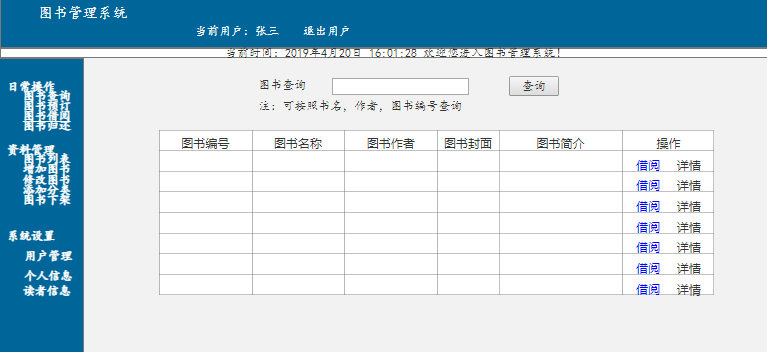

# 实验5：图书管理系统数据库设计与界面设计
|学号|班级|姓名|照片|
|:-------:|:-------------: | :----------:|:---:|
|12345678|软件(本)15-4|赵卫东||

## 1.数据库表设计

## 1.1. 系统管理员(L_Admin)
|字段|类型|主键，外键|可以为空|默认值|约束|说明|
|:-------:|:-------------:|:------:|:----:|:---:|:----:|:-----|
|a_id|int|主键|否|||管理员编号|
|a_name|varchar(100)| |否|||管理员姓名|
|a_pwd|varchar(100)| |否|||管理员密码|

## 1.2. 读者表(L_Reader)
|字段|类型|主键，外键|可以为空|默认值|约束|说明|
|:-------:|:-------------:|:------:|:----:|:---:|:----:|:-----|
|r_id|int|主键|否|||读者编号|
|r_name|varchar(20)| |否|||读者姓名|
|r_pwd|varchar(20)| |否|||读者密码|
|r_sex|bit| |否|||读者性别|
|r_photo|varchar(100)| |否|||读者头像|
|r_email|varchar(100)| |是|||读者邮箱|
|r_contact|varchar(20)| |否|||读者联系方式|
|r_grade|varchar(20)| |是|||读者年级|
|r_academy|varchar(20)| |是|||读者学院|
|r_major|varchar(20)| |是|||读者专业|
|r_allcountbook|int| |否|||总共借阅图书数量|
|r_maxcount|int| |否|||最大可借阅数量|

## 1.3. 图书信息表(L_Book)
|字段|类型|主键，外键|可以为空|默认值|约束|说明|
|:-------:|:-------------:|:------:|:----:|:---:|:----:|:-----|
|b_id|int|主键|否|||图书编号|
|b_name|varchar(100)| |否|||图书名称|
|ISBN|char(13)|外键|否|||国际标准图书编码|
|b_bkcaseid|varchar(20)|外键|否|||书架编号|
|b_price|numeric(10,2)| |否|||定价|
|b_author|varchar(20)| |否|||作者|
|b_typeid|int|外键|否|||图书类型编号|
|b_intime|DataTime| |否|||入库时间|
|b_synopsis|varchar(100)| |是|||图书简介|
|b_state|bit| |否|||图书状态|
|b_photo|varchar(100)| |是|||封面图书|


## 1.4. 图书类型表(L_BookType)
|字段|类型|主键，外键|可以为空|默认值|约束|说明|
|:-------:|:-------------:|:------:|:----:|:---:|:----:|:-----|
|bt_id|int|主键|否|||类型编号|
|bt_name|varchar(20)| |否|||类型名称|


## 1.5. 出版社信息表(L_publishing)
|字段|类型|主键，外键|可以为空|默认值|约束|说明|
|:-------:|:-------------:|:------:|:----:|:---:|:----:|:-----|
|ISBN|char(13)|主键|否|||国际标准图书编号|
|p_name|varchar(100)| |否|||出版社名称|

## 1.6. 借阅管理表(L_Borrow)
|字段|类型|主键，外键|可以为空|默认值|约束|说明|
|:-------:|:-------------:|:------:|:----:|:---:|:----:|:-----|
|bw_id|int|主键|否|||借阅编号|
|bw_bookid|varchar(30)|外键|否|||图书编号|
|bw_readerid|int|外键|否|||读者编号|
|bw_outtime|DataTime| |否|||借出时间|
|bw_endtime|DataTime| |否|||到期时间|
|bw_backtime|DataTime| |否|||归还时间|
|bw_isexpired|bit| |否||否|是否过期|
|bw_fine|numeric| |否||0|罚款数目|

## 1.7. 图书资源表(L_Resource)
|字段|类型|主键，外键|可以为空|默认值|约束|说明|
|:-------:|:-------------:|:------:|:----:|:---:|:----:|:-----|
|rs_id|int|主键|否|||资源编号|
|rs_name|varchar(30)| |否|||资源名称|
|rs_synopsis|varchar(500)| |是|||资源简介|
|rs_amount|int| |是|||资源大小|
|rs_type|varchar(20)| |是|||资源类型|


## 1.8. 书架信息表(L_BookCase)
|字段|类型|主键，外键|可以为空|默认值|约束|说明|
|:-------:|:-------------:|:------:|:----:|:---:|:----:|:-----|
|bc_id|int|主键|否|||书架编号|
|bc_typeid|int|外键|否|||类型编号|


## 1.9. 预约管理表(L_ReservedBook)
|字段|类型|主键，外键|可以为空|默认值|约束|说明|
|:-------:|:-------------:|:------:|:----:|:---:|:----:|:-----|
|rb_id|int|主键|否|||预约编号|
|rb_bookid|varchar(30)|外键|否|||图书编号|
|rb_readerid|int|外键|否|||读者编号|
|rb_outtime|DataTime| |否|||预约时间|
|rb_endtime|DataTime| |否|||到期时间|
|rb_taketime|DataTime| |否|||拿走时间|
|rb_isexpired|bit| |否||否|是否过期|
***

## 2. 界面设计
## 2.1. 借书界面设计

- 用例图参见：借书用例
- 类图参见：借书类，读者类
- 顺序图参见：借书顺序图
- API接口如下：

1. 获取全部图书

- 功能：用于获取全部分类
- 请求地址： https://wwhkiller.github.io/is_analysis_pages/ui/index.html
- 请求方法：POST
- 请求参数：无
- 返回实例：
```
{
   
    "data": {
        "b_id": "001",
        "b_name": "信息系统分析",
        "b_author": "张三",
        "b_photo": "photo",
        "b_synopsis": "简介",
         },
    "code": 200
}
```
- 返回参数说明：
    
|参数名称|说明|
|:-------:|:-------------: |
|b_id|图书编号|
|b_name|图书名称|
|b_author|图书作者|
|b_photo|图书封面|
|b_synopsis|图书简介|

2. 借出图书API
- 功能：用于获取全部分类
- 请求地址:(https://wwhkiller.github.io/is_analysis_pages/ui/page1.html) 
- 请求方法：POST
- 请求参数：


|参数名称|必填|说明|
|:-------:|:-------------: | :----------:|
|b_id|是|图书编号|验证图书信息|
|r_id|是|读者编号|验证读者信息|

- 返回实例：
```
{
    "info": "借阅表单",
    "data": {
        "bw_id": "001",
        "bw_bookid": "001",
         "b_name": "信息系统分析",
        "bw_readerid": "001",
         "r_name": "张三",
        "bw_outtime": "2019年4月20日",
        "bw_endtime": "2019年6月20日",
        "bw_backtime": "2019年5月20日",
        "bw_isexpired": "否"
         "bw_fine": "0"
               },
    "code": 200
}
```
- 返回参数说明：
    
|参数名称|说明|
|:-------:|:-------------: |
|bw_id|借阅编号|
|bw_bookid|图书编号|
|b_name|图书名称|
|bw_readerid|读者编号|
|r_name|读者姓名|
|bw_outtime|借出时间|
|bw_endtime|到期时间|
|bw_backtime|归还时间|
|bw_isexpired|是否过期|
|bw_fine|罚款数目|


 