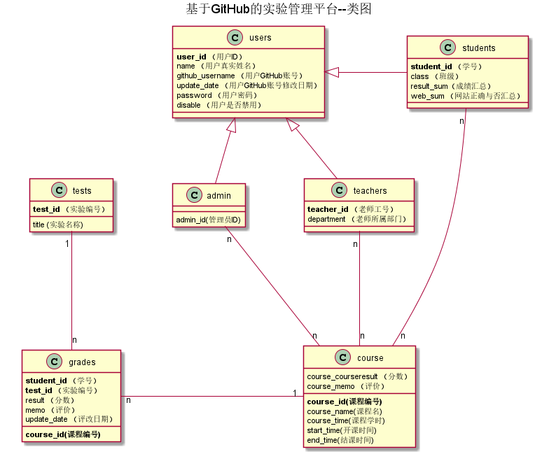

# 基于类似于GitHub平台的实验管理平台的分析与设计

### 成都大学信息科学与工程学院

|学号|班级|姓名|照片|
|:-------:|:-------------: | :----------:|:---:|
|201610414325|软件(本)16-3|吴伟辉||

## 1. 概述
- 基于类似于GitHub平台的实验管理平台的作用是在线管理实验成绩的Web应用系统。学生和老师的实验内容均存放在Github,Gitlab,Gitee等页面上。
- 学生的功能主要有：一是设置自己的Github,Gitlab,Gitee等用户名，二是查询自己的实验成绩。学生的Github,Gitlab,Gitee等用户名是公开的，但成绩不公开。
- 学生可以在实验平台中绑定帐号，如果有多个帐号，可以选择提交作业的帐号。
- 老师的功能主要有：一是批改每个学生的成绩，二是查看每个学生的成绩。
- 老师和学生都能通过本系统的链接方便地跳转到学生的每个Github,Gitlab,Gitee实验目录，以便批改实验或者查看实验情况。
- 老师可以开多门课程，学生可以选择多门课程，学生选课时需要老师开了次课程。
- 老师在评分的时候可以给每一个小题设置分数，最后分数由系统自加,每个小题也可以由教室设置分值与数量。
- 实验成绩按数字分数计算，每项实验的满分为100分，最低为0分。
- 学期结束后该课程不会结束，下学期可以让其他学生选择该课程。
- 老师可以根据学科要求设置实验次数和实验分值。
- 系统自动计算每个学生的所有实验的平均分。
    
## 2. 系统总体结构

界面设计参见：https://wwhkiller.github.io/is_analysis_pages/test6_Ui/index.html
    
## 3. 用例图设计 [源码](UseCase.puml)

## 4. 类图设计 [源码](src/class.puml)

## 5. 数据库设计
- ### [参见数据库设计](./数据库设计.md)

## 6. 用例及界面详细设计
- ### [“学生列表”用例](./用例/学生列表.md),[界面](https://zwdbox.github.io/is_analysis/test6/ui/index.html)
- ### [“评定成绩”用例](./用例/评定成绩.md),[界面](https://zwdbox.github.io/is_analysis/test6/ui/评定成绩.html)
- ### [“查看成绩”用例](./用例/查看成绩.md),[界面](https://zwdbox.github.io/is_analysis/test6/ui/查看成绩.html)
- ### [“修改密码”用例](./用例/修改密码.md),[界面](https://zwdbox.github.io/is_analysis/test6/ui/顶部菜单.html)
- ### [“修改用户信息”用例](./用例/修改用户信息.md),[界面](https://zwdbox.github.io/is_analysis/test6/ui/顶部菜单.html)
- ### [“查看用户信息”用例](./用例/查看用户信息.md),[界面](https://zwdbox.github.io/is_analysis/test6/ui/顶部菜单.html)
- ### [“登出”用例](./用例/登出.md),[界面](https://zwdbox.github.io/is_analysis/test6/ui/顶部菜单.html)
- ### [“登录”用例](./用例/登录.md),[界面](https://zwdbox.github.io/is_analysis/test6/ui/登录.html)
    